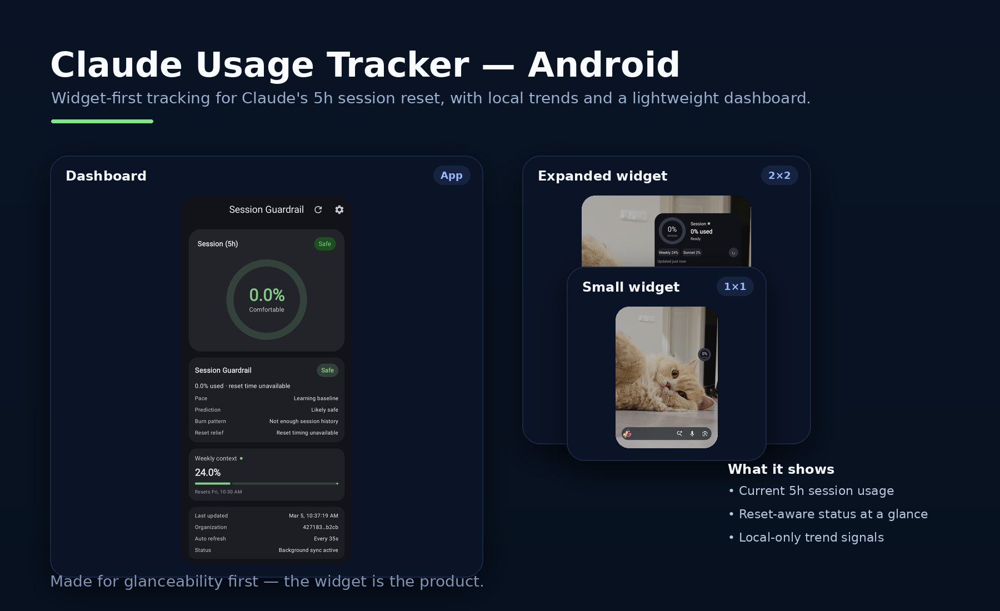

# OpenUsage — AI Usage for Android

Local-first Android dashboard and **home-screen widgets** for Claude session and weekly usage,
Codex weekly usage, and Grok weekly unified-billing usage.

> Widget-first by design. The app exists to set up the widget, show history, and tune notifications.

## Preview



## Why this exists

Claude’s usage window is easy to lose track of while you’re deep in work.
This utility keeps the important provider limits together on your home screen:

- **Claude session and weekly usage**
- **Codex and Grok weekly usage**
- **Used and remaining headroom for every available limit**

## Highlights

- **OpenUsage dashboard**: one live Claude session hero with nested Claude weekly usage, plus Codex and Grok cards
- **Direct provider refresh** from the phone; no always-on desktop bridge
- **Local-only guardrail insights** (no remote analytics pipeline)
  - pace vs your usual at the same point in session
  - simple cap-risk prediction (“likely to exhaust before reset”)
  - burn-window hints (when you typically spike)
  - reset relief (high usage is less scary when reset is soon)
- **Local per-session history capture** (simple raw samples)
- **Home-screen widget** with periodic background refresh
- **Codex weekly usage** fetched directly on the phone with device-code sign-in and automatic token refresh
- **Grok weekly usage** fetched directly with xAI device-code sign-in and automatic token refresh
- **Optional notifications** for session reset + usage milestones + guardrail warnings

## Widgets

One responsive widget scales across three useful launcher sizes:

- **2×2**: four compact usage rings for Claude session, Claude weekly, Codex weekly, and Grok weekly
- **4×2**: four provider rows with usage bars, percentages, reset times, and sync status (recommended)
- **4×3**: a larger Claude session hero plus Claude, Codex, and Grok weekly rows

Disconnected providers stay visible with a setup prompt, so the layout remains stable.

## Download APK

- Latest release direct download:
  [app-debug.apk](https://github.com/maplenk/claude-usage/releases/latest/download/app-debug.apk)
- Release page:
  [Latest release](https://github.com/maplenk/claude-usage/releases/latest)

## Prerequisites

| Tool | Version | Install |
|------|---------|---------|
| JDK | 17 | `brew install openjdk@17` |
| Android SDK | API 35 | Via Android Studio or `sdkmanager` |
| Gradle | 8.11.1 | Bundled wrapper (`./gradlew`) |

Set environment variables before building (or let Android Studio handle it):

```bash
export JAVA_HOME=$(/usr/libexec/java_home -v 17)
export ANDROID_HOME="$HOME/Library/Android/sdk"
```


## Notifications

- **Session reset notification**: Optional alert when the 5-hour session usage resets to `0%`.
- **Usage milestone notifications**: Optional alerts for Session (5h) usage milestones at `75%`, `80%`, `85%`, `90%`, and `100%`.
- **Guardrail notifications**:
  - Current pace may exhaust session before reset.
  - Session reset expected in ~15 minutes.
  - You're below your usual pace at the same point in session.
- **Highest-only per refresh**: At most one milestone notification per refresh cycle, using current utilization text (for example, `Limit used 88%`).
- **No backfill spam**: If usage jumps from `75%` to `88%`, the app sends one alert for the current usage value instead of multiple intermediate alerts.
- **Upgrade-safe behavior**: If a user updates while already above a milestone and no milestone has been recorded in the current cycle, one current-value alert is sent once, then deduplicated.
- **Independent toggle**: Milestone notifications are controlled separately from session-reset notifications in Settings (`Notify on usage milestones`).

## Testing

```bash
# Run unit tests (requires JDK 17)
./build.sh testDebugUnitTest
```

## Project Structure

```
cc-usage/
├── build.gradle.kts                       # Project-level plugins
├── settings.gradle.kts                    # Module config
├── gradle.properties                      # Build settings
├── gradle/
│   ├── wrapper/gradle-wrapper.properties  # Gradle 8.11.1
│   └── libs.versions.toml                 # Version catalog (all dependency versions here)
└── app/
    ├── build.gradle.kts                   # App dependencies & config
    ├── proguard-rules.pro
    └── src/main/
        ├── AndroidManifest.xml
        ├── java/com/qbapps/claudeusage/
        │   │
        │   ├── ClaudeUsageApp.kt          # @HiltAndroidApp, WorkManager init
        │   ├── MainActivity.kt            # Single activity, hosts Compose nav
        │   │
        │   ├── domain/                    # Pure Kotlin models & interfaces
        │   │   ├── model/
        │   │   │   ├── ClaudeUsage.kt     # Core data: fiveHour, sevenDay, opus, sonnet metrics
        │   │   │   ├── Organization.kt    # Org uuid + name
        │   │   │   ├── UsageError.kt      # Sealed class: Unauthorized, RateLimited, etc.
        │   │   │   ├── UsageHistoryPoint.kt # Raw per-sample session snapshots
        │   │   │   └── UsageStatus.kt     # SAFE / MODERATE / CRITICAL enum (thresholds: 50%, 80%)
        │   │   ├── guardrail/
        │   │   │   └── SessionGuardrailEvaluator.kt # Pace + cap-risk + burn-window evaluation
        │   │   └── repository/
        │   │       └── UsageRepository.kt # Interface
        │   │
        │   ├── data/                      # API, storage, repo implementation
        │   │   ├── remote/
        │   │   │   ├── ClaudeApiService.kt      # Retrofit: GET /api/organizations, GET /api/organizations/{id}/usage
        │   │   │   ├── AuthInterceptor.kt       # OkHttp interceptor, injects Cookie header
        │   │   │   ├── UsageResponseDto.kt      # JSON DTOs with @SerializedName
        │   │   │   └── UtilizationAdapter.kt    # Gson adapter (utilization can be Int/Double/String)
        │   │   ├── local/
        │   │   │   ├── SecureCredentialStore.kt  # EncryptedSharedPreferences (session key, org ID)
        │   │   │   ├── UsageDataStore.kt         # Preferences DataStore — app cache
        │   │   │   ├── UsageHistoryStore.kt      # CSV-backed usage history (30-day retention)
        │   │   │   └── UserPreferencesStore.kt   # Preferences DataStore — user settings (refresh interval, org)
        │   │   ├── repository/
        │   │   │   └── UsageRepositoryImpl.kt    # Fetches API → saves cache → pushes to widget
        │   │   └── mapper/
        │   │       └── UsageMapper.kt            # DTO → domain conversion
        │   │
        │   ├── di/                        # Hilt dependency injection
        │   │   ├── AppModule.kt           # Binds UsageRepository
        │   │   └── NetworkModule.kt       # Provides Retrofit, OkHttp, Gson
        │   │
        │   ├── ui/                        # Jetpack Compose screens
        │   │   ├── theme/
        │   │   │   ├── Color.kt           # Material3 palette + status colors
        │   │   │   ├── Theme.kt           # ClaudeUsageTheme, dynamic color support
        │   │   │   └── Type.kt
        │   │   ├── navigation/
        │   │   │   ├── Screen.kt          # Sealed class: Dashboard, Settings
        │   │   │   └── AppNavHost.kt      # NavHost with bottom nav bar
        │   │   ├── dashboard/
        │   │   │   ├── DashboardScreen.kt       # Pull-to-refresh, usage cards, error handling
        │   │   │   ├── DashboardViewModel.kt    # Auto-refresh loop, fetches usage
        │   │   │   └── components/
        │   │   │       ├── UsageCard.kt          # Card: label, progress bar, %, countdown
        │   │   │       ├── SessionGuardrailCard.kt # Decision-support session guidance card
        │   │   │       ├── UsageProgressBar.kt   # Animated color-coded progress bar
        │   │   │       ├── CountdownTimer.kt     # Live countdown to reset time
        │   │   │       └── StatusIndicator.kt    # Colored dot
        │   │   └── settings/
        │   │       ├── SettingsScreen.kt         # Key input, org picker, interval slider, clear
        │   │       ├── SettingsViewModel.kt      # Validates key, saves config, starts sync
        │   │       └── components/
        │   │           ├── SessionKeyInput.kt    # Password field with paste + visibility toggle
        │   │           └── RefreshIntervalSlider.kt  # 5–300 second slider
        │   │
        │   ├── widget/                    # Glance home screen widget
        │   │   ├── UsageWidget.kt               # GlanceAppWidget, SizeMode.Responsive (3 sizes)
        │   │   ├── UsageWidgetContent.kt        # Widget composable: progress bars, status colors
        │   │   ├── UsageWidgetReceiver.kt       # GlanceAppWidgetReceiver
        │   │   ├── UsageWidgetStateDefinition.kt # Separate DataStore for widget state
        │   │   ├── WidgetActionCallback.kt      # Tap → open app, refresh button
        │   │   └── WidgetDataPusher.kt          # Pushes usage data into all widget instances
        │   │
        │   └── worker/                    # Background sync
        │       ├── UsageSyncWorker.kt           # @HiltWorker, fetches + re-enqueues
        │       └── WorkManagerScheduler.kt      # Schedules OneTimeWork chain + 15-min periodic fallback
        │
        └── res/
            ├── xml/usage_widget_info.xml        # Widget provider metadata (sizes, preview)
            ├── layout/glance_default_loading_layout.xml
            ├── drawable/
            │   ├── widget_background.xml        # Light mode rounded rect
            │   └── widget_background_dark.xml   # Dark mode rounded rect
            ├── mipmap-*/                        # App icons (all densities + adaptive + round)
            ├── values/
            │   ├── colors.xml
            │   ├── strings.xml
            │   └── themes.xml
            └── values-night/colors.xml
```

The Wear OS companion remains deliberately deferred; this release includes only the phone app and
Android home-screen widgets.

## Architecture

```
Claude API ──► Phone UsageRepositoryImpl
                         ├──► Phone DataStore / history
                         ├──► Android home-screen widgets
                         └──► Notifications

Codex WHAM API ──► Phone CodexUsageRepositoryImpl
                           ├──► Encrypted OAuth token storage
                           ├──► Codex weekly DataStore cache
                           ├──► Android dashboard
                           └──► Android home-screen widgets

Grok billing API ──► Phone GrokUsageRepositoryImpl
                           ├──► Encrypted OAuth token storage
                           ├──► Grok weekly DataStore cache
                           ├──► Android dashboard
                           └──► Android home-screen widgets
```

- **Foreground**: ViewModel refresh loop at user-configured interval (5–300s)
- **Background**: WorkManager OneTimeWork chain for sub-15-min intervals + 15-min periodic safety net
- **Widget**: Reads from its own Glance Preferences DataStore, updated by repository on every fetch
- **Wear OS**: no active module or phone-side sync in this release

## API

| Endpoint | Method | Auth |
|----------|--------|------|
| `https://claude.ai/api/organizations` | GET | `Cookie: sessionKey=sk-ant-sid01-...` |
| `https://claude.ai/api/organizations/{orgId}/usage` | GET | Same |
| `https://chatgpt.com/backend-api/wham/usage` | GET | Codex device-login bearer token |
| `https://cli-chat-proxy.grok.com/v1/billing?format=credits` | GET | xAI device-login bearer token |

Codex authentication uses the Codex CLI's device-code flow. Access, refresh, and ID tokens are stored
with Android Keystore-backed encrypted preferences and are never copied into widget state. The WHAM
endpoint is not a public OpenAI API contract, so its response mapping may need maintenance if the
ChatGPT backend changes.

Grok authentication uses xAI's RFC 8628 device-code flow. OpenUsage stores its refreshable tokens in
the same Android Keystore-backed encrypted preferences and reads only the weekly unified-billing meter.

## Credits

The multi-provider usage approach and direct provider integration research were informed by
[OpenUsage by Robin Ebers](https://github.com/robinebers/openusage). This Android project is an
independent implementation tailored to its dashboard and home-screen widgets.

## Key Dependencies

All versions managed in `gradle/libs.versions.toml`:

- **Compose BOM** 2024.12.01 (Material3)
- **Glance** 1.1.1 (widget framework)
- **Hilt** 2.53.1 (DI)
- **Retrofit** 2.11.0 + OkHttp 4.12.0
- **DataStore** 1.1.1
- **WorkManager** 2.10.0
- **Security Crypto** 1.1.0-alpha06 (EncryptedSharedPreferences)
- **Min SDK** 26 | **Target SDK** 35

## Extract Your Session Key

1. Open Claude AI
   Navigate to `https://claude.ai` in your browser and make sure you're logged in.
2. Open Developer Tools
   Chrome/Edge: press `F12` or `Cmd+Option+I` (macOS) / `Ctrl+Shift+I` (Windows).
   Safari: enable the Developer menu in Preferences -> Advanced, then press `Cmd+Option+I`.
   Firefox: press `F12` or `Cmd+Option+I` (macOS) / `Ctrl+Shift+I` (Windows).
3. Navigate to Cookies
   Go to Application (Chrome/Edge) or Storage (Firefox), then open Cookies -> `https://claude.ai`.
4. Copy the session key
   Find the `sessionKey` cookie and copy its value (starts with `sk-ant-sid01-...`).

## Setup Flow

1. Open app → redirected to Settings if no session key
2. Paste your Claude session key (`sk-ant-sid01-...`)
3. Tap Validate → fetches organizations → select org
4. Optionally connect Codex and Grok from their device-login cards
5. Dashboard shows every connected provider and the widget starts updating
6. Add the OpenUsage widget to the home screen from the widget picker

To add Codex weekly usage, open Settings → Codex → **Connect Codex**, copy the one-time code,
complete sign-in in the browser, and return to the app. The phone then refreshes Codex independently
of the computer and synchronizes the weekly percentage and reset time to the dashboard and widget.

## Release Notes

### v0.5.0

- Repositioned the app around a "Session Guardrail" experience.
- Reworked dashboard hierarchy: hero Session ring, guardrail insights, lighter secondary context.
- Added decision-support insights:
  - Pace vs usual at the same point in the 5-hour session.
  - Time-to-cap prediction and cap-before-reset risk detection.
  - Typical burn-window detection (early/mid/late session behavior).
  - Reset-relief hinting when budget is low but reset is near.
- Added local guardrail notifications for cap-risk, reset-soon (15m), and below-usual pace.
- Simplified settings surface into grouped cards with advanced tools hidden by default.
- Refined widget layouts for 1x1, 2x1, and 2x2 to be purpose-built, not mini dashboards.

### v0.4.0

- Added persistent usage history tracking with 30-day retention.
- Added dashboard trend chart with selectable ranges: `1h`, `6h`, `1d`, `7d`, `30d`.
- Added quick trend summaries (latest, average, peak) for 5h and 7d windows.
- Added Settings action to clear usage history.
- Updated "Clear All Data" to also remove cached usage + history snapshots.

### v0.3.0

- 1x1 widget now renders as a circular icon (transparent background) to match app icon size.
- Added screenshots to README.

### v0.2.0

- Added Session (5h) usage milestone notifications at `75%`, `80%`, `85%`, `90%`, and `100%`.
- Added new Settings preference: `Notify on usage milestones`.
- Implemented highest-only milestone delivery per refresh cycle.
- Notification body now reflects current utilization (for example, `Limit used 84%`).
- Added dedupe persistence to avoid repeated milestone alerts for the same cycle.
- Preserved existing session-reset notification behavior.
- Added unit tests for threshold evaluation behavior.

## Credits

- Original project inspiration and API behavior reference:
  [hamed-elfayome/Claude-Usage-Tracker](https://github.com/hamed-elfayome/Claude-Usage-Tracker)

## Contributors

- [@claude](https://github.com/claude) (Claude Code)
- [@codex](https://github.com/codex)
